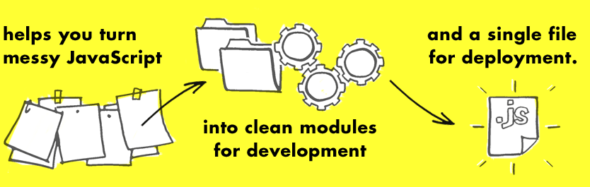
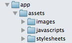
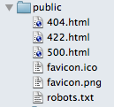
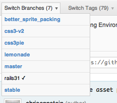
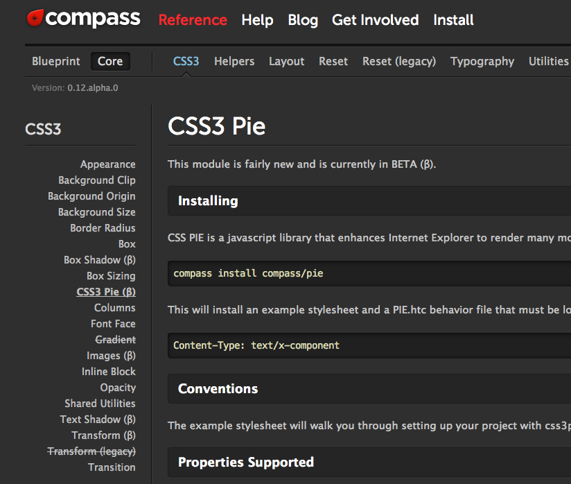
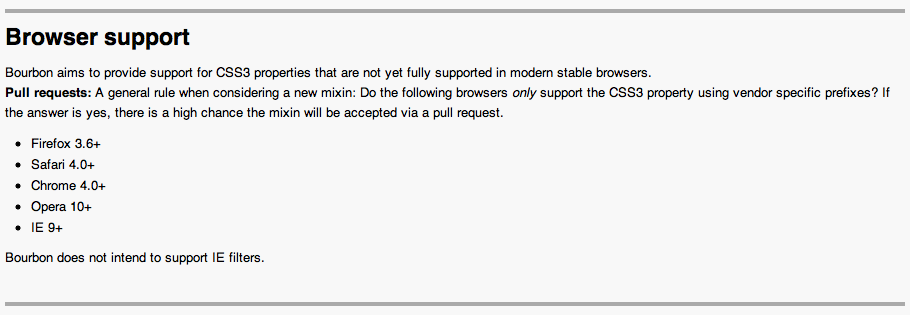
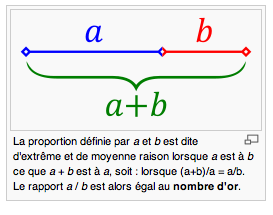

!SLIDE

# Les vues de Rails 3.1.
## Sprocket, Bourbon, et l'asset pipeline

!SLIDE

* Thibaut Assus, développeur depuis 2007, avec Rails [http://github.com/tibastral](http://github.com/tibastral)
* Je suis consultant pour ma société Milesrock, je fais du consulting ruby/rails/js
* Je vais parler de Rails 3.1 asset pipeline avec Sprocket, Bourbon

!SLIDE

## Sprocket

* Rails 3.1 introduit par défaut sprocket, pour gérer ses assets.
* On y gagne en performances, et en rapidité de chargement (tout est mis en cache).

!SLIDE

## L'arborescence des assets!

* avant : tout était dans **/public**
* Aujourd'hui, on a un dossier /app/assets dans lequel on a 3 sous dossiers

!SLIDE

## Et notre dossier */public* sent le *propre* !

!SLIDE

## DHH : With 3.1, assets become *first class citizens*

### Et vu qu'ils font maintenant partie de l'application, au même titre que les autres fichiers, on va pouvoir :

* utiliser nativement des préprocesseurs css (sass)
* utiliser nativement des préprocesseurs js (coffeescript)
* pouvoir compresser / optimiser / mettre en cache tout ça !
* n'avoir à la fin qu'un seul css, et qu'un seul js

!SLIDE

# Et Compass dans tout ça ?

!SLIDE

## Avec Rails 3.1 Compass passe du rang de framework css au rang de bibliothèque sass

* Dans la branche rails31 de compass, compass ne fait plus tout le traffic qu'il faisait pour charger les css.
* Maintenant compass se contente de définir des mixins sass absolument indispensables à toute personne amenée à faire du css.

!SLIDE

## Exemple :

* Mon client me demande une compatibilité ie7, et veut des bords arrondis...
* Je veux utiliser blueprint, mais sous forme de mixins, et pas sous forme de classes css

!SLIDE

## Compass est à la rescousse :

!SLIDE

## Mais tout ça n'est qu'un début !

### Compass est un exemple des possibilités infinies que nous offre 3.1 et l'asset pipeline.

Grâce à rails 3.1, on va pouvoir :

* introduire des petites bibliothèques css réutilisables pour plusieurs projets (comme fancy-button par exemple)
* versionner ces bibliothèques
* introduire des dépendances entre ces bibliothèques
* provoquer des conflits si certaines bibliothèques sont incompatibles !
* Bref, vous voyez où il veut en venir quand DHH dit *first class citizen*

!SLIDE

## et c'est EXACTEMENT la même chose pour javascript et coffeescript !!

* on va arriver dans l'aire industrielle du javascript
* quand on va mettre à jour nos bibliothèques javascript, on n'aura plus à se demander si on ne va pas tout casser à chaque fois
* tout cela sera versionné avec bundler !

!SLIDE

## En un mot :

* mettre à jour les bibliothèques js d'un projet ne sera plus un calvaire.

!SLIDE

## La barrière à l'entrée des frameworks css étant plus basse, nous assistons à l'arrivée de Bourbon (par thoughtbot)

* nouveau venu dans les bibliothèques de mixins/fonctions css, Bourbon est déjà très complet !
* il permet de faire du css3 compatible avec les anciens navigateurs
* concernant le support des browsers, bourbon est CLAIREMENT en opposition avec Compass

!SLIDE

## Un petit truc agréable dans *Bourbon*, c'est le mixin golden-ration.

* C'est pas grand chose, mais ça permet de faire des designs calqués sur le nombre d'or (1 + racine(5)) / 2

!SLIDE

## Bonus : Modernizr (polyfills) & Yepnope

### Cas concret : mon client veut des placeholders compatibles ie7

* Modernizr permet de détecter la présence de l'implémentation des placoholders.
* Yepnope.js me permet de loader uniquement dans le cas où l'implémentation n'est pas présente un polyfill
* Voici une liste des polyfills proposés par modernizr (https://github.com/Modernizr/Modernizr/wiki/HTML5-Cross-Browser-Polyfills)
* Ainsi, plus d'excuse pour faire du html5 + css3

!SLIDE

## Conclusion

!SLIDE

# Merci !

!SLIDE

#